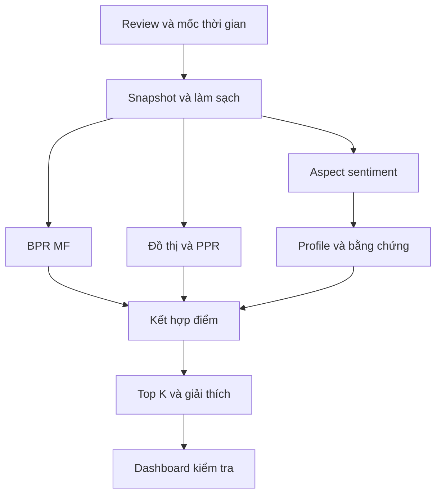

# Định hướng và phạm vi

## Quyết định thiết kế

**Bài toán chính là gợi ý top K sản phẩm có khả năng được người dùng đánh giá tích cực trong tương lai.** Đầu ra gồm danh sách xếp hạng, các lý do có căn cứ và thông tin về mức độ đầy đủ của bằng chứng. Giao diện cho phép điều chỉnh ưu tiên theo khía cạnh để quan sát danh sách thay đổi.

Tên tiếng Anh đề xuất: **TrustRec: Evidence-aware Product Recommendation with Aspect Opinions and Interaction Graphs**. Trong tài liệu, “aspect” có nghĩa là khía cạnh sản phẩm, “item” là sản phẩm và “review” là bài đánh giá của người dùng.

Trong TrustRec, “Trust” được giới hạn ở khả năng kiểm tra bằng chứng và mức độ chắc chắn của phần tổng hợp ý kiến. PageRank cao thể hiện vị trí trong đồ thị; nó không xác nhận một người dùng trung thực. Amazon Reviews 2023 cũng không cung cấp nhãn thật giả cho từng review trong schema đang sử dụng. Vì vậy, phát hiện review giả không phải tuyên bố đầu ra của bản cốt lõi.

| Thành phần | Phạm vi đề xuất |
|:---|:---|
| Loại project | Method và System Hybrid |
| Quy mô nhóm | 3–4 thành viên |
| Ngôn ngữ dữ liệu | Review tiếng Anh; báo cáo và giao diện có thể dùng tiếng Việt |
| Miền ưu tiên | Video Games, tập trung phần mềm game và loại phụ kiện phần cứng |
| Bài toán chính | Top K recommendation, với K bằng 5, 10 và 20 |
| Phương pháp cốt lõi | BPR MF, Personalized PageRank, aspect sentiment và kết hợp điểm |
| Phần tạo khác biệt | Tổng hợp bằng chứng có trọng số, kết hợp thích ứng, giải thích có truy vết |
| Mở rộng có điều kiện | node2vec, mô hình NLP mạnh hơn, đa dạng hóa danh sách |

Ưu tiên Video Games vì các khía cạnh như gameplay, story và performance tạo được tình huống demo dễ hiểu. Điện tử tiêu dùng vẫn là phương án thay thế nếu khảo sát ban đầu cho thấy dữ liệu game không tạo đủ lịch sử người dùng. Chỉ chốt một miền sau bước kiểm tra dữ liệu ở tuần 2–3.

## Mức độ phù hợp với môn học

Syllabus cho phép Link analysis, Opinion mining, Recommendation systems và dạng Hybrid; Information retrieval bị loại khỏi chủ đề capstone. Capstone chiếm khoảng 85% phần giữa kỳ; phần giữa kỳ chiếm 40% tổng điểm [1].

| Nội dung môn học | Cách sử dụng trong TrustRec | Minh chứng có thể trình bày |
|:---|:---|:---|
| Opinion mining [2] | Nhận diện khía cạnh, sentiment và câu bằng chứng | Bộ nhãn, F1, lỗi phủ định và nhiều khía cạnh |
| Link analysis [3] | Đồ thị hai phía và Personalized PageRank | Xếp hạng từ đồ thị, đường liên hệ, phân tích độ phổ biến |
| Recommendation systems [4] | Item kNN, MF và đánh giá ranking | So sánh baseline, dữ liệu thưa, phân nhóm người dùng |
| Machine learning [5] | SVM, validation, calibration và phân tích lỗi | Giao thức huấn luyện và thí nghiệm có thể lặp lại |
| Data visualization [6] | Phân bố dữ liệu, biểu đồ khía cạnh, đồ thị con | Dashboard kiểm tra vì sao một sản phẩm được gợi ý |

Những yêu cầu như số baseline, ablation và khoảng tin cậy dưới đây là khuyến nghị về chất lượng nghiên cứu. Syllabus không đưa ra rubric chi tiết cho từng hạng mục, nên không quy đổi chúng thành số điểm được bảo đảm.

# Bài toán và câu hỏi nghiên cứu

## Tình huống sử dụng

Hai người cùng chấm một game 4 sao nhưng có thể quan tâm đến những yếu tố khác nhau. Người thứ nhất thích cốt truyện và gameplay; người thứ hai coi trọng hiệu năng và multiplayer. Chỉ dùng rating tổng có thể bỏ qua sự khác biệt này. Ngược lại, chỉ đọc review cũng bỏ lỡ tín hiệu từ những người có lịch sử tương tự.

TrustRec kết hợp hai nguồn thông tin đó với đồ thị tương tác. Hệ thống cần xử lý cả trường hợp bằng chứng mâu thuẫn: một game được khen về story nhưng bị chê về performance. Phần giải thích phải phản ánh cả ưu điểm lẫn đánh đổi có liên quan đến sở thích của người dùng.

Ví dụ minh họa về hành vi sản phẩm: người dùng tăng ưu tiên performance và giảm ưu tiên graphics. Danh sách có thể thay đổi thứ tự; hệ thống cho biết sản phẩm nào tăng hạng và khía cạnh nào gây ra thay đổi. Đây là mô phỏng thay đổi đầu vào của mô hình, không phải bằng chứng nhân quả về hành vi mua hàng.

## Câu hỏi nghiên cứu

| Mã | Câu hỏi | Phép kiểm chứng chính |
|:---:|:---|:---|
| RQ1 | Ý kiến theo khía cạnh và đồ thị có bổ sung thông tin hữu ích cho CF không? | So sánh CF, CF cộng aspect, CF cộng graph và mô hình đầy đủ |
| RQ2 | Kết hợp thích ứng theo lịch sử và bằng chứng có tốt hơn trọng số cố định không? | Giữ nguyên các module, thay cơ chế kết hợp; phân nhóm theo lịch sử |
| RQ3 | Trọng số bằng chứng có giúp tổng hợp ý kiến ổn định hơn không? | Đánh giá với review trùng lặp và sentiment bị gây nhiễu có kiểm soát |
| RQ4 | Lời giải thích có đúng nguồn và phản ánh mô hình không? | Chấm claim so với câu gốc; kiểm tra đóng góp điểm và thử loại bằng chứng |

Giả thuyết cần kiểm tra là thông tin khía cạnh hữu ích hơn khi lịch sử tương tác ngắn nhưng sản phẩm có đủ review. Nếu cả lịch sử người dùng và bằng chứng sản phẩm đều ít, kết hợp thêm module có thể không cải thiện kết quả. Kết quả âm có phân tích vẫn trả lời được câu hỏi nghiên cứu.

## Đóng góp dự kiến và nghiên cứu liên quan

Phân tích sentiment để giải thích recommendation đã có tiền lệ. Explicit Factor Models khai thác các đặc trưng rõ nghĩa từ review và kết hợp chúng với mô hình gợi ý [8]. BPR cung cấp mục tiêu tối ưu thứ hạng cá nhân hóa [9]; node2vec học biểu diễn từ lân cận đồ thị [10]; NCF mô hình hóa tương tác người dùng và sản phẩm bằng mạng neural [11].

TrustRec kế thừa các hướng này và đề xuất một thiết kế cụ thể cho capstone: tổng hợp ý kiến có xét độ chắc chắn và trùng lặp, điều chỉnh mức sử dụng aspect khi dữ liệu thưa, rồi kiểm tra lời giải thích dưới giao thức thời gian. Nhóm cần mô tả đây là cải tiến và đánh giá ở phạm vi project; chưa có cơ sở tuyên bố thuật toán hoàn toàn mới hoặc đạt state of the art.

# Đặc tả đầu vào và đầu ra

## Ký hiệu và mục tiêu

Gọi $U$ là tập người dùng, $I$ là tập sản phẩm và $\mathcal{A}$ là tập khía cạnh. Một bản ghi review có người dùng $u$, sản phẩm $i$, rating $r$, văn bản $x$ và thời điểm $t$. Tại mốc dự đoán $\tau$, hệ thống chỉ được sử dụng thông tin đã biết trước mốc đó:

$$
\mathcal{D}_{<\tau}=\{(u,i,r,x,t):t<\tau\}.
$$

Danh mục $I_\tau$ gồm các sản phẩm đã xuất hiện trong lịch sử trước $\tau$. Tập $H_u(\tau)$ chứa tất cả sản phẩm người dùng đã đánh giá trước mốc đó, bao gồm rating thấp. Tập ứng viên là:

$$
\mathcal{C}_u(\tau)=I_\tau\setminus H_u(\tau).
$$

TrustRec trả về $K$ sản phẩm có điểm lớn nhất trong tập này. Nếu còn ít hơn $K$ ứng viên, trả số sản phẩm thực có và ghi nhận trường hợp đó trong evaluation.

Rating từ 4 trở lên được xem là tín hiệu tích cực cho bài toán ranking. Rating 1–2 là phản hồi tiêu cực đã quan sát; rating 3 là trung gian. Việc không có review là thông tin chưa quan sát, không chứng minh rằng người dùng không thích sản phẩm. Đây là giới hạn của đánh giá offline dựa trên review.

## Cấu trúc kết quả

Mỗi đề xuất cần lưu item ID, vị trí, điểm tổng, điểm thành phần, mốc dữ liệu, phiên bản mô hình và danh sách bằng chứng. Mỗi bằng chứng cần có review ID nội bộ, đoạn văn gốc, khía cạnh, sentiment dự đoán, thời điểm và chỉ số hỗ trợ.

Một lời giải thích đủ điều kiện có thể viết: “Game này có đánh giá tốt về gameplay, một khía cạnh bạn thường đề cập. Bằng chứng đang dùng là các đoạn review bên dưới.” Nếu chưa có dữ liệu cá nhân hóa, giao diện nói rõ lý do đến từ ưu tiên người dùng vừa chọn hoặc từ xu hướng chung.

Không sinh phần trăm người đồng ý từ điểm sentiment. Một thống kê phần trăm chỉ được hiển thị khi có tử số, mẫu số, tập review và thời điểm xác định. Điểm mô hình cũng không được trình bày thành xác suất mua hàng nếu chưa có bài toán calibration phù hợp.

# Dữ liệu và khảo sát khả thi

## Nguồn và lựa chọn miền

Amazon Reviews 2023 của McAuley Lab có review, rating, định danh người dùng, timestamp và metadata sản phẩm. Tài liệu nguồn liệt kê khoảng 4,6 triệu rating trong Video Games và 43,9 triệu trong Electronics. Metadata được nối bằng `parent_asin`; một số sản phẩm có thể thiếu metadata [7].

Bước đầu tải review và metadata của một category, đọc tuần tự và chuyển phần cần dùng sang Parquet. Không nạp toàn bộ category lớn vào RAM. Giữ bản gốc, checksum, ngày tải và mã nguồn tạo subset để người khác dựng lại dữ liệu.

Phạm vi khởi đầu đề xuất là **100.000–300.000 review và khoảng 5.000–15.000 item**, sau đó điều chỉnh theo kết quả khảo sát. Đây là ngân sách xử lý dự kiến, không phải thống kê đã xác nhận. Chọn subset theo quy tắc cố định từ dữ liệu huấn luyện; lấy đủ lịch sử trong phạm vi đã chọn, thay vì rút ngẫu nhiên từng dòng rồi làm mất chuỗi tương tác.

Với Video Games, khảo sát metadata để xác định game phần mềm, nền tảng và phụ kiện. Không gán aspect story hay gameplay cho tay cầm hoặc thiết bị sạc. Giữ các phiên bản sản phẩm theo ID nguồn; việc gộp nhiều nền tảng phải được kiểm tra vì hiệu năng có thể khác nhau.

## Điều kiện chốt dữ liệu

Trong tuần 2–3, nhóm lập báo cáo profiling gồm: số user, item, review; tỷ lệ thiếu text; phân bố rating; số review trên mỗi user; số review trên mỗi item; tính liên thông của graph; số user còn target hợp lệ sau chia thời gian.

Mục tiêu lập kế hoạch là có ít nhất khoảng 2.000 người dùng đánh giá được ở validation và test, đồng thời còn một nhóm người dùng ít lịch sử đủ lớn để phân tích. Nếu chưa đạt, mở rộng phạm vi game hoặc thời gian trước khi giảm độ khó của mô hình. Không sử dụng score trên test để chọn miền dữ liệu.

Không áp dụng bộ lọc 5-core lên toàn bộ dữ liệu rồi tuyên bố đã đánh giá cold-start. Bộ lọc đó loại nhiều user và item ít tương tác. Nếu dùng 5-core để so sánh với công trình khác, báo cáo nó như một thí nghiệm riêng và nêu tỷ lệ dữ liệu bị loại.

## Schema nội bộ

| Bảng | Các trường chính | Vai trò |
|:---|:---|:---|
| interactions | review ID, user ID, item ID, rating, timestamp | Nguồn tương tác và thời gian |
| review_texts | review ID, text, language, duplicate group | Văn bản và kiểm soát trùng lặp |
| aspect_evidence | review ID, span, aspect, sentiment, confidence | Kết quả NLP có truy vết |
| user_profiles | user ID, cutoff, aspect weights, history count | Hồ sơ tại một snapshot |
| item_profiles | item ID, cutoff, aspect score, support | Tổng hợp ý kiến trước cutoff |
| recommendations | user ID, snapshot, rank, item ID, component scores | Kết quả phục vụ và kiểm thử |

Review ID nội bộ có thể là hash ổn định của các trường nguồn. Lưu offset của câu và đoạn bằng chứng để đối chiếu được với văn bản gốc. Chuẩn hóa tên trường và đơn vị timestamp sau khi đọc schema thực tế, thay vì giả định mọi file có tên cột giống nhau.

## Làm sạch dữ liệu

Giữ negation và từ chỉ mức độ khi xử lý văn bản. Tách câu, loại markup và chuẩn hóa khoảng trắng nhưng bảo toàn text gốc. Với cùng user và item, giữ sự kiện đầu tiên cho bài toán tương tác đầu tiên; các cập nhật về sau chỉ có thể tham gia snapshot sau thời điểm xuất hiện và không trở thành target mới trong benchmark chính.

Nhận diện bản sao bằng hash văn bản chuẩn hóa; kiểm tra thêm near-duplicate bằng n-gram nếu cần. Các bản sao phải ở cùng một phần của bộ gold NLP. Phát hiện trùng lặp không đồng nghĩa xác định gian lận: nhiều người có thể viết những câu ngắn giống nhau một cách tự nhiên.

Các trường như `helpful_vote`, rating tổng trên trang sản phẩm và giá tại thời điểm thu thập không có lịch sử đầy đủ trong thiết kế này. Không dùng chúng làm feature lịch sử chính. Thống kê rating và độ phổ biến phải tính lại từ review trước cutoff. Metadata mô tả dùng cho việc xác định miền hoặc hiển thị phải được ghi nhận là snapshot, không phải hồ sơ đầy đủ theo thời gian [7].

# Giao thức thời gian và chống rò rỉ dữ liệu

## Chia dữ liệu theo mốc chung

Chọn hai mốc $T_0<T_1$ áp dụng cho toàn bộ tập dữ liệu. Có thể bắt đầu bằng các phân vị timestamp tương ứng khoảng 80% và 90% số interaction, rồi ghi lại ngày giờ cụ thể. Không hứa tỷ lệ này tạo được số user đủ lớn trước khi profiling.

| Giai đoạn | Thông tin được phép dùng | Mục đích |
|:---|:---|:---|
| Train | Sự kiện trước $T_0$ | Huấn luyện model, dựng graph và profile |
| Validation | Target từ $T_0$ đến trước $T_1$ | Chọn hyperparameter và ngưỡng |
| Fit cuối | Sự kiện trước $T_1$ | Dựng lại toàn bộ mô hình với cấu hình đã chốt |
| Test | Target từ $T_1$ đến hết cửa sổ test | Đánh giá một lần theo protocol đã khóa |

Trong benchmark chính, model và profile được đóng băng tại đầu mỗi cửa sổ. Mỗi user được đánh giá một danh sách; target là các sản phẩm mới đối với user, thuộc danh mục đã biết tại đầu cửa sổ và có rating từ 4 trở lên trong cửa sổ đó. Các target ngoài danh mục không được âm thầm bỏ qua: báo cáo số lượng và tỷ lệ của chúng.

Một cách chia “review cuối của từng user” vẫn có thể cho phép mô hình học từ sự kiện tương lai của user khác. Vì vậy, dùng mốc thời gian chung thay cho chỉ sắp thứ tự trong từng user. Nghiên cứu của Ji và cộng sự phân tích trực tiếp vấn đề này [12].

## Quy tắc sử dụng văn bản

Review được viết sau trải nghiệm sản phẩm. Khi dự đoán một target tương lai, văn bản của target đó chưa được phép xuất hiện trong user profile, item profile, graph, từ điển học từ corpus hay explanation. Review cũ của người khác về sản phẩm vẫn có thể dùng nếu nó thực sự có trước cutoff.

Từ điển aspect khai phá, IDF, mô hình sentiment, bộ phát hiện duplicate, thống kê nền và embedding đều phải có nguồn gốc snapshot rõ ràng. Khi fit cuối trước test, dựng lại những thành phần phụ thuộc dữ liệu từ tập trước $T_1$. Không chỉ huấn luyện lại MF trong khi giữ item profile tính từ toàn bộ dữ liệu.

## Các kiểm tra bắt buộc trong mã nguồn

1. Timestamp lớn nhất của mọi feature và evidence nhỏ hơn cutoff của snapshot.
2. Không có cặp user và item đã thấy trong danh sách gợi ý của benchmark chính.
3. Không có target review ID trong evidence hoặc feature tạo ra dự đoán tương ứng.
4. Tất cả model được đánh giá trên cùng tập user, candidate và target ở mỗi snapshot.
5. Metadata tổng hợp hậu kỳ không đi vào feature lịch sử một cách ngầm định.
6. Gold NLP test và test recommendation không được dùng chọn ngưỡng hay hyperparameter.

Các assertion này xác minh rủi ro cụ thể của pipeline. Lưu một báo cáo kiểm tra tự động cùng kết quả thí nghiệm để có thể bảo vệ protocol khi thuyết trình.

# Phân tích ý kiến theo khía cạnh

## Bộ khía cạnh và nhãn

Với game phần mềm, bắt đầu bằng tám khía cạnh sau. Sau pilot, có thể gộp hoặc bỏ khía cạnh quá ít ví dụ trước khi khóa gold test.

| Khía cạnh | Nội dung đánh giá | Ví dụ ý kiến tích cực |
|:---|:---|:---|
| Gameplay | Cơ chế chơi và mức cuốn hút | Cơ chế chiến đấu thú vị |
| Story | Cốt truyện và nhân vật | Nhân vật được xây dựng tốt |
| Graphics | Hình ảnh và phong cách thị giác | Hình ảnh rõ, đẹp |
| Performance | Tốc độ, lỗi và độ ổn định | Chạy ổn định, ít giật |
| Controls | Điều khiển và thao tác | Điều khiển phản hồi tốt |
| Multiplayer | Chơi cùng người khác | Chơi đồng đội thuận tiện |
| Content and replay | Nội dung và giá trị chơi lại | Nhiều nội dung đáng quay lại |
| Value | Mức xứng đáng với chi phí | Trải nghiệm xứng với số tiền bỏ ra |

Mỗi đơn vị gán nhãn gồm câu hoặc mệnh đề, aspect được nhắc tới, đoạn bằng chứng và sentiment positive, negative hoặc neutral. Nếu câu chứa nhiều ý trái chiều, tách mệnh đề khi có thể. Trường hợp còn mơ hồ được đánh dấu để adjudication; không ép nó thành neutral chỉ để hoàn thành dữ liệu.

Các khía cạnh được định nghĩa theo chất lượng mong muốn. Ví dụ value tốt nghĩa là đáng tiền; nó không đồng nhất với giá tuyệt đối thấp. Tương tự, việc user chê performance nhiều lần cho thấy họ quan tâm performance, không có nghĩa họ thích game chạy kém.

## Bộ gold và quy trình gán nhãn

Manual annotation là dữ liệu **held-out evaluation**, không phải dữ liệu train. Mọi review/câu/mệnh đề đã được gán nhãn thủ công đều không được dùng để huấn luyện hoặc fit mô hình recommendation, aspect extraction hay sentiment. Amazon Reviews 2023 của McAuley Lab vẫn là nguồn chính cho training/recommendation interactions và corpus dùng trong pipeline; nhóm không cần gán nhãn thủ công toàn bộ corpus.

Chia manual labels thành hai vai trò rõ ràng:

- **Development/pilot subset (tuỳ chọn):** dùng để chỉnh guideline, prompt, threshold hoặc model settings và phân tích lỗi. Subset này vẫn bị loại khỏi model training và không được dùng làm final test.
- **Final test subset:** gold-standard labels dùng để đánh giá aspect extraction, sentiment classification và explanation quality. Khóa subset này trước khi tuning; sau khi khóa, không dùng nó để chọn prompt, threshold, hyperparameter hoặc model settings.

Mục tiêu đề xuất là khoảng **1.500 câu** có nội dung đủ đa dạng, phân bổ giữa development/pilot và final test theo nhóm sản phẩm, đồng thời giữ near-duplicate cùng nhóm. Không tạo manual train split. Mẫu được lấy từ corpus trước $T_0$, độc lập với nhãn target recommendation tương lai. Tỷ lệ và số lượng cuối cùng phải ghi trong split manifest sau khi pilot được review.

Lấy mẫu kết hợp ngẫu nhiên và phân tầng để có positive, negative, neutral, câu nhiều aspect và câu không thuộc bộ aspect. Không chỉ chọn các câu chứa keyword của bộ luật, vì như vậy sẽ bỏ sót nhiều cách diễn đạt mà mô hình cần nhận diện.

Ít nhất 20% câu được hai thành viên gán nhãn độc lập. Báo cáo Cohen's kappa cho sentiment trên các cặp aspect đã căn chỉnh, cùng mức đồng thuận về aspect; sau đó giải quyết bất đồng theo guideline. Không diễn giải kappa cho nhãn sentiment như chất lượng đầy đủ của span extraction.

Pilot 100 câu để chỉnh guideline và đo thời gian. Ngân sách ban đầu 25–40 giờ người dành cho đọc, gán nhãn và adjudication cần được điều chỉnh từ pilot. Mọi ví dụ sửa guideline phải thuộc development/pilot; final test đã khóa chỉ dùng cho đánh giá cuối.

## Phân chia dữ liệu cho mô hình và manual evaluation

| Phân vùng | Vai trò | Được phép sử dụng | Không được sử dụng |
|:---|:---|:---|:---|
| Amazon Reviews 2023 của McAuley Lab | Nguồn chính | Training/fitting recommendation interactions, snapshot, graph và corpus pipeline theo cutoff | Không coi missing feedback là negative đã biết |
| Manual development/pilot subset | Tinh chỉnh quy trình | Sửa guideline, prompt, threshold, model settings và debug | Không train model; không chấm final test; không chuyển ngầm thành test |
| Manual final test subset | Gold evaluation | Đánh giá aspect extraction, sentiment và explanation quality sau khi khóa | Không tuning, prompt selection, threshold selection hay model training |

Manual labeling là lấy mẫu có kiểm soát, không phải yêu cầu gán nhãn toàn bộ Amazon Reviews 2023. Mỗi artifact manual phải lưu split role, label status, source snapshot, guideline/prompt version và các hạn chế sử dụng.

## Mô hình NLP

Manual labels không đi vào bước huấn luyện. Nếu cần dữ liệu có nhãn để xây baseline aspect/sentiment, sử dụng corpus Amazon Reviews 2023 với weak/silver labels hoặc nguồn được ghi rõ trong manifest; không gọi đó là manual gold training data. Manual development chỉ dùng để chọn quy tắc/prompt/settings theo policy ở trên, còn manual final test chỉ được đọc sau khi mọi lựa chọn đã khóa.

Baseline đầu tiên dùng từ điển aspect, keyword sentiment và luật phủ định. Baseline tiếp theo dùng TF-IDF và Linear SVM cho nhận diện aspect dạng multi-label; sentiment nhận đầu vào là mệnh đề cùng target aspect. Một bộ phân loại cả review thành positive hoặc negative không đủ để gọi là aspect sentiment.

Với câu “The story is engaging, but the game keeps crashing”, module cần tạo hai bản ghi: story positive và performance negative. Mẫu này do nhóm tự tạo để mô tả hành vi, không phải bằng chứng thực nghiệm.

Ưu tiên feature n-gram, target aspect, phạm vi phủ định và mệnh đề chứa target. Nếu SVM cho margin thay vì xác suất, hiệu chỉnh bằng cross-validation trên NLP train; NLP validation dùng chọn ngưỡng từ chối và hyperparameter. Không dùng margin thô như xác suất đúng.

Chỉ thử thêm một mô hình mạnh hơn sau khi baseline ổn định, chẳng hạn CNN hoặc BiLSTM gắn với nội dung môn học. Giữ cùng bộ nhãn và protocol để biết cải thiện đến từ thuật toán, không phải thay đổi dữ liệu.

## Đầu ra và đánh giá NLP

Lưu sentiment score $z_{ra}$ trong khoảng $[-1,1]$ cho review $r$ ở aspect $a$. Có thể tính từ xác suất đã hiệu chỉnh: $z_{ra}=P(+)-P(-)$. Lưu thêm độ tin cậy trích xuất $c_{ra}$, ví dụ tích của xác suất có aspect và xác suất của sentiment được chọn. Đây là độ tin cậy của dự đoán NLP, không phải xác suất review chân thật.

Báo cáo micro F1 và macro F1 cho aspect detection; macro F1 cho sentiment trên gold aspect; F1 của cặp aspect và polarity cho toàn pipeline. Nếu hệ thống lưu span theo luật, đánh giá riêng tỷ lệ span chứa bằng chứng phù hợp. Báo cáo thêm coverage khi mô hình từ chối các trường hợp không chắc chắn.

# Tổng hợp bằng chứng và hồ sơ khía cạnh

## Trọng số review

Mỗi review chỉ đóng góp một lần cho một cặp item và aspect sau khi gộp các mệnh đề của nó. Các cập nhật của cùng tác giả trên cùng item được hợp nhất theo snapshot. Mục tiêu là tránh một người hoặc một đoạn văn lặp lại chi phối thống kê.

Đề xuất trọng số cho bằng chứng:

$$
q_{ra}(\tau)=c_{ra}\,d_r\,\exp\left(-\ln(2)\frac{\tau-t_r}{h}\right).
$$

Trong đó $d_r=1/m_r$ nếu review thuộc một nhóm gồm $m_r$ bản sao cùng item; $h$ là chu kỳ bán rã theo ngày. Với thí nghiệm không dùng giảm trọng số theo thời gian, đặt nhân tử thời gian bằng 1. Đây là giả thuyết thiết kế cần ablation, vì review cũ có thể vẫn hữu ích.

Việc phạt duplicate nhằm hạn chế ảnh hưởng lặp thông tin, không gán nhãn gian lận. Ngưỡng near-duplicate quá mạnh có thể làm giảm trọng số các review hợp lệ, nên kiểm tra thủ công một mẫu các cặp bị gộp.

## Điểm sản phẩm trên từng khía cạnh

Gọi $R_{ia}(\tau)$ là tập bằng chứng của item $i$ về aspect $a$ trước cutoff. Đặt $S_{ia}=\sum_{r\in R_{ia}}q_{ra}$ và $\mu_a$ là sentiment nền của aspect, tính chỉ từ dữ liệu quá khứ. Dùng shrinkage để điểm từ ít review không quá cực đoan:

$$
v_{ia}=\frac{\lambda\mu_a+\sum_{r\in R_{ia}}q_{ra}z_{ra}}
{\lambda+S_{ia}},\qquad
C_{ia}=\frac{S_{ia}}{\lambda+S_{ia}}.
$$

$\lambda>0$ kiểm soát mức kéo về giá trị nền. $C_{ia}$ là chỉ số hỗ trợ, không phải khoảng tin cậy thống kê. Nếu chưa có bằng chứng, $v_{ia}=\mu_a$ và $C_{ia}=0$; không coi khía cạnh chưa biết là tiêu cực.

Theo dõi thêm số tác giả khác nhau và effective sample size $N_{ia}^{\mathrm{eff}}=(\sum q_{ra})^2/\sum q_{ra}^2$ khi mẫu khác rỗng. Con số này giúp phát hiện trọng số tập trung nhưng không bảo đảm các review độc lập; lời giải thích vẫn cần thể hiện số tác giả và mức bất đồng.

Với review trái chiều, lưu riêng khối lượng positive, negative và neutral. Nếu hai phía đều lớn, hiển thị “ý kiến còn phân tán” cùng bằng chứng đại diện; không chỉ chọn câu thuận lợi nhất rồi bỏ qua phần còn lại.

## Hồ sơ quan tâm của người dùng

Gọi $n_{ua}$ là số review quá khứ của user $u$ có đề cập aspect $a$, tối đa một lượt đếm mỗi review và aspect. Trọng số quan tâm được làm trơn bằng phân bố nền $\pi_a$:

$$
w_{ua}=\frac{n_{ua}+\alpha\pi_a}{\sum_b n_{ub}+\alpha}.
$$

Các $w_{ua}$ cộng lại bằng 1. Phân bố nền chỉ được học trên snapshot huấn luyện. Tần suất đề cập là một giả định về sự quan tâm, nên giao diện cho phép người dùng sửa; nó không phải phép đo chính xác sở thích tâm lý.

Điểm phù hợp theo aspect và mức hỗ trợ cá nhân hóa là:

$$
A(u,i)=\sum_{a\in\mathcal{A}}w_{ua}(v_{ia}-\mu_a),\qquad
C(u,i)=\sum_{a\in\mathcal{A}}w_{ua}C_{ia}.
$$

Phần trừ $\mu_a$ giúp đo mức tốt hơn hoặc kém hơn mặt bằng của cùng aspect. Khi user chưa có review chứa aspect, profile là prior; hệ thống phải nói rõ đây là mức quan tâm mặc định hoặc hỏi ưu tiên trực tiếp.

# Đồ thị tương tác và mô hình cộng tác

## Đồ thị hai phía

Xây $G_\tau=(U_\tau\cup I_\tau,E_\tau)$ từ các rating tích cực trước cutoff. Một cạnh user và item biểu thị một đánh giá từ 4 sao trở lên. Trong phiên bản đầu, mỗi cạnh có trọng số 1; các rating thấp vẫn được giữ ở lịch sử để loại item đã thấy khỏi candidate.

Sử dụng Personalized PageRank với phân bố khởi động lại tập trung ở user. Nếu $P$ là ma trận chuyển trạng thái chuẩn hóa theo hàng và $e_u$ là vector đặt toàn bộ khối lượng tại user $u$:

$$
p_u=(1-d)e_u+dP^{\mathsf T}p_u.
$$

$d$ là damping factor. Điểm graph $G(u,i)$ lấy từ thành phần item trong $p_u$. Node không có cạnh dùng fallback đã định nghĩa; không tạo vector bằng 0 rồi coi là kết quả cá nhân hóa thành công. Với dangling node, khối lượng được phân phối lại theo $e_u$.

PPR khai thác các đường liên hệ dạng user, item đã thích, user có liên hệ, item mới. Nó có thể bị thiên lệch về item phổ biến. Vì vậy, cần baseline popularity và phân tích theo nhóm độ phổ biến trước khi kết luận graph tạo giá trị.

Community detection chủ yếu dùng giải thích cấu trúc và tìm lỗi. Nếu nó không tham gia điểm gợi ý, báo cáo đúng vai trò phân tích. Node2vec là phương án mở rộng để so sánh với PPR, có thêm chi phí huấn luyện và bài toán node mới [10].

## BPR Matrix Factorization

Chọn BPR MF làm mô hình cộng tác chính vì bài toán cần thứ hạng. Điểm cơ sở có dạng:

$$
s_{\mathrm{MF}}(u,i)=b_i+\boldsymbol{p}_u^{\mathsf T}\boldsymbol{v}_i.
$$

Huấn luyện trên bộ ba $(u,i,j)$, trong đó $i$ là item user đã đánh giá tích cực và $j$ là item chưa được user đánh giá trong dữ liệu huấn luyện:

$$
\mathcal{L}_{\mathrm{BPR}}=-\sum_{(u,i,j)}\log\sigma\left(s_{\mathrm{MF}}(u,i)-s_{\mathrm{MF}}(u,j)\right)
+\lambda_{\mathrm{reg}}\lVert\Theta\rVert_2^2.
$$

Item $j$ phải thuộc danh mục đã biết của snapshot. Không đọc target tương lai để sửa quá trình negative sampling. Mẫu chưa quan sát là giả định phục vụ huấn luyện ranking, không được mô tả thành nhãn không thích đã biết. Thí nghiệm dùng rating 1–2 làm negative rõ ràng có thể thực hiện riêng [9].

MF tối ưu bình phương sai số có thể là baseline phụ cho dự đoán rating. Nếu thực hiện, báo cáo RMSE và MAE ở bảng riêng. Không tính RMSE trực tiếp trên điểm BPR hoặc điểm hybrid chưa được ánh xạ và hiệu chỉnh về thang rating.

## Chuẩn hóa điểm

MF, PPR và aspect có thang giá trị khác nhau. Trước khi kết hợp, chuyển mỗi thành phần thành percentile rank trong cùng candidate set của từng user. Item bằng điểm nhận thứ hạng trung bình; nếu toàn bộ điểm bằng nhau, thành phần đó nhận một giá trị hằng.

Ký hiệu điểm chuẩn hóa là $\widetilde{M}$, $\widetilde{G}$ và $\widetilde{A}$, đều trong $[0,1]$. Dùng cùng cách chuẩn hóa cho baseline kết hợp và mô hình đề xuất. Các score này là điểm xếp hạng tương đối, không phải xác suất.

# Phương pháp kết hợp của TrustRec

## Baseline trọng số cố định

Baseline hybrid tuyến tính có dạng:

$$
s_{\mathrm{fixed}}(u,i)=a_M\widetilde{M}(u,i)+a_G\widetilde{G}(u,i)+a_A\widetilde{A}(u,i),
$$

với các trọng số không âm và tổng bằng 1. Chọn chúng trên validation. Đây là đối chứng cần thiết: nếu TrustRec chỉ tốt hơn MF nhưng không tốt hơn hybrid đơn giản, chưa thể kết luận cơ chế thích ứng có ích.

## Trọng số thích ứng theo dữ liệu

Gọi $n_u$ là số interaction quá khứ của user. Đề xuất mức chuyển sang thông tin aspect:

$$
g(u,i)=g_{\max}\frac{\kappa}{\kappa+n_u}C(u,i),
$$

$$
s_{\mathrm{base}}(u,i)=\rho\widetilde{M}(u,i)+(1-\rho)\widetilde{G}(u,i),
$$

$$
s_{\mathrm{TrustRec}}(u,i)=[1-g(u,i)]s_{\mathrm{base}}(u,i)+g(u,i)\widetilde{A}(u,i).
$$

Trong đó $0\leq g_{\max}\leq1$, $\kappa>0$ và $0\leq\rho\leq1$. Khi user có ít lịch sử và item có đủ bằng chứng cho các aspect quan trọng, module aspect nhận trọng số lớn hơn. Khi bằng chứng yếu, mô hình dựa nhiều hơn vào cộng tác và graph.

Đây là một cơ chế có thể kiểm chứng, không phải công thức tối ưu đã biết. Nếu validation cho thấy trọng số cố định tốt hơn, chọn cấu hình đó cho demo và báo cáo trung thực kết quả của giả thuyết thích ứng. Không chọn lại công thức sau khi đã nhìn test.

Các trọng số kết hợp được chọn trên validation; MF và NLP huấn luyện độc lập. Tránh huấn luyện bộ kết hợp trên các cặp train bằng feature chứa chính review mục tiêu rồi coi đó là bằng chứng cải thiện, vì cách làm này dễ tạo lợi thế không có ở thời điểm suy luận.

## Trường hợp thiếu tín hiệu

Nếu user không có cạnh tích cực nhưng có review về aspect, dùng nhánh aspect kết hợp popularity đã tính từ quá khứ; ghi nhận đây là nhánh fallback riêng. Nếu không có cả lịch sử lẫn ưu tiên được khai báo, trả popularity theo miền với lý do tương ứng.

User hoàn toàn mới chỉ có thể được cá nhân hóa sau onboarding, chẳng hạn chọn ba aspect và vài game đã thích. Dữ liệu offline không chứa các lựa chọn này, nên đánh giá onboarding bằng tình huống demo hoặc nghiên cứu người dùng riêng, không trộn nó vào benchmark lịch sử tự nhiên.

Item hoàn toàn mới, chưa có interaction và review, chưa được các nhánh cốt lõi hỗ trợ. Muốn xử lý cần thêm nội dung sản phẩm có thời điểm sẵn có rõ ràng. Do đó, kết quả chính chỉ áp dụng cho item đã có bằng chứng và user có lịch sử ít hoặc nhiều.

## Đa dạng hóa như thí nghiệm mở rộng

Khi có kết quả cốt lõi, có thể rerank bằng quy tắc chọn tuần tự cân bằng relevance và độ giống với các item đã chọn:

$$
i^*=\arg\max_{i\in\mathcal{C}_u\setminus L}
\left[\eta s_{\mathrm{TrustRec}}(u,i)-(1-\eta)\max_{j\in L}\operatorname{sim}(i,j)\right].
$$

Khi $L$ rỗng, phần phạt bằng 0. Similarity cần được định nghĩa nhất quán, chẳng hạn cosine giữa vector item đã chuẩn hóa, và tính từ snapshot quá khứ. Báo cáo đường đánh đổi NDCG và diversity khi thay $\eta$; không cộng một hằng “diversity bonus” cho từng item rồi tuyên bố đã tối ưu độ đa dạng của cả danh sách.

# Giải thích có bằng chứng

## Cơ chế sinh lý do

Từ điểm aspect, chọn khía cạnh có đóng góp dương $w_{ua}(v_{ia}-\mu_a)$ lớn, đồng thời đạt ngưỡng hỗ trợ. Nếu có khía cạnh quan trọng nhưng đóng góp âm, hiển thị một điểm cần cân nhắc. Với cùng item, tránh đưa nhiều đoạn gần trùng từ cùng một tác giả.

Mỗi câu giải thích được sinh bằng template gắn với evidence có thật. Ví dụ: “Bạn thường đề cập gameplay. Review quá khứ của game này cho thấy gameplay được đánh giá tốt hơn mức nền; dưới đây là những đoạn được dùng để tổng hợp.” Nếu chỉ có ba tác giả, cần hiển thị con số đó và mức hỗ trợ thấp thay vì nói “đa số cộng đồng”.

Phần điểm cộng tác và graph được tách khỏi phần giải thích aspect. Giao diện có thể cho biết tỷ trọng của từng nhánh và một đường liên hệ trong graph. Không trình bày một đường đi bất kỳ như toàn bộ nguyên nhân toán học của điểm PPR.

## Mức độ đầy đủ và mâu thuẫn

Ngưỡng hiển thị giải thích mạnh phải được chọn bằng NLP validation và tập kiểm tra evidence development. Một điều kiện khởi đầu có thể yêu cầu ít nhất năm tác giả, effective sample size đủ lớn và confidence NLP trên ngưỡng. Các giá trị này cần sensitivity analysis, không trở thành quy tắc chân lý.

Khi chưa đủ điều kiện, hệ thống vẫn có thể gợi ý bằng CF nhưng ghi “chưa đủ review để giải thích chắc chắn theo khía cạnh”. Đánh giá phải tính cả tỷ lệ được giải thích và tỷ lệ đúng; không chỉ chấm những lời giải thích dễ nhất rồi bỏ qua phần hệ thống từ chối.

## Kiểm tra faithfulness

Lưu đóng góp số học của ba nhánh trong score, cùng từng hạng tử của điểm aspect. Các giá trị cộng lại phải khớp score đã dùng để xếp hạng trong giới hạn sai số số học.

Để kiểm tra độ nhạy, bỏ các bằng chứng của aspect được nêu, dựng lại item profile rồi tính lại điểm. Giữ nguyên candidate và ánh xạ chuẩn hóa điểm của lượt gợi ý ban đầu khi đo tác động cục bộ. So sánh mức thay đổi với việc bỏ bằng chứng ngẫu nhiên có cùng số lượng.

Một sản phẩm vẫn có thể giữ thứ hạng cao vì CF hoặc graph. Kết quả này cần được phản ánh trong lời giải thích; việc có câu review phù hợp không chứng minh câu đó quyết định toàn bộ recommendation.

# Thiết kế thí nghiệm

## Baseline và ablation

| Mã | Mô hình | Vai trò |
|:---:|:---|:---|
| B0 | Most popular | Đối chứng không cá nhân hóa |
| B1 | Item kNN | Baseline cộng tác gắn với môn học |
| B2 | BPR MF | Baseline học latent factors |
| B3 | Personalized PageRank | Đo riêng thông tin đồ thị |
| B4 | Aspect only | Đo riêng thông tin ý kiến |
| H0 | MF cộng graph cộng aspect cố định | Đối chứng hybrid trực tiếp |
| T0 | TrustRec đầy đủ | Mô hình đề xuất |
| A1 | T0 bỏ graph | Đóng góp của graph |
| A2 | T0 bỏ aspect | Đóng góp của opinion mining |
| A3 | T0 dùng trung bình aspect không trọng số | Đóng góp của tổng hợp evidence |
| A4 | T0 dùng trọng số kết hợp cố định | Kiểm tra cơ chế thích ứng |

Đối với A3, giữ shrinkage giống nhau để việc so sánh tập trung vào trọng số review. Sau đó mới thử riêng từng thành phần confidence, duplicate và recency nếu kết quả cho thấy cần phân tích. Mọi ablation dùng cùng dữ liệu, candidate và ngân sách tuning; không cho T0 nhiều cơ hội chọn cấu hình hơn baseline.

B0 đến B2, H0 và T0 là bộ tối thiểu trước checkpoint. Các baseline riêng từng module và ablation hoàn thiện sau checkpoint. NCF và node2vec là mở rộng; số thuật toán nhiều hơn không thay thế cho một phép so sánh công bằng.

## Metric chính

Với user $u$, $R_u$ là tập target hợp lệ và $L_u^K$ là danh sách top K. Recall đo mức tìm lại target, còn NDCG đo cả việc target xuất hiện ở vị trí cao:

$$
\operatorname{Recall@K}(u)=\frac{|L_u^K\cap R_u|}{|R_u|},
$$

$$
\operatorname{DCG@K}(u)=\sum_{k=1}^{K}\frac{\mathbb{1}[L_u^K[k]\in R_u]}{\log_2(k+1)},\qquad
\operatorname{NDCG@K}(u)=\frac{\operatorname{DCG@K}(u)}{\operatorname{IDCG@K}(u)}.
$$

Dùng relevance nhị phân theo ngưỡng rating đã chốt. Báo cáo trung bình trên các user có ít nhất một target hợp lệ. Nêu số user không đủ điều kiện và lý do. NDCG@10 là metric lựa chọn mô hình chính; Recall@10 và các K khác hỗ trợ diễn giải.

Precision@K và F1@K có thể báo cáo bổ sung để gắn với slide. Không diễn giải item chưa được review trong tương lai như một negative chắc chắn ngoài đời; các metric phản ánh dữ liệu quan sát trong benchmark.

## Các góc đánh giá bổ sung

| Góc đánh giá | Cách đo | Giới hạn diễn giải |
|:---|:---|:---|
| Coverage | Tỷ lệ item danh mục xuất hiện trong top K của tập user đánh giá | Phụ thuộc candidate và tập user |
| Novelty | Trung bình âm log độ phổ biến đã làm trơn từ train | Ít phổ biến chưa chắc hữu ích |
| Diversity | Trung bình $1-\operatorname{sim}$ trên cặp item trong danh sách | Phụ thuộc biểu diễn similarity |
| Evidence correctness | Tỷ lệ claim phù hợp đoạn gốc khi chấm thủ công | Cần lấy mẫu cả ca khó |
| Explanation coverage | Tỷ lệ đề xuất có lý do đạt ngưỡng hỗ trợ | Luôn đi kèm correctness |
| Latency và tài nguyên | p50, p95 của suy luận, RAM, thời gian fit | Ghi rõ máy và cache |

Rating prediction là nhánh phụ nếu có thời gian. RMSE và MAE thuộc nhánh này; chúng không thay thế cho NDCG của bài toán top K.

## Phân nhóm dữ liệu thưa

Tính nhóm theo số interaction trước cutoff: 1–2, 3–5 và trên 5. Với item, phân tích nhóm ít hoặc nhiều review trước cutoff. Báo cáo số mẫu của từng nhóm và khoảng tin cậy; gộp nhóm nếu quá nhỏ và nêu rõ quyết định trước khi đọc test score.

Gọi các nhóm 1–2 hoặc 3–5 là ít lịch sử. User có 0 interaction là trường hợp hoàn toàn mới và đánh giá riêng với fallback. Nếu mô phỏng xóa lịch sử của user cũ, phải gọi đây là stress test nhân tạo; dựng lại feature sau xóa và không coi nó tương đương phân bố user mới tự nhiên.

## Kiểm tra độ bền với nhiễu

Tạo một stress test phụ trên dữ liệu quá khứ của snapshot: nhân bản một phần review hoặc đảo một phần polarity đầu ra NLP với tỷ lệ 5%, 10%, 20%. Seed, tập target và candidate giữ cố định. Đo thay đổi NDCG, thứ hạng và mức lệch của item aspect profile so với dữ liệu gốc.

Nhân bản được dùng để kiểm tra duplicate weighting; đảo polarity kiểm tra khả năng chịu sai số NLP. Những thao tác này chỉ mô phỏng nhiễu. Nếu mô hình ổn định hơn, kết luận là chịu được loại nhiễu đã thử, không kết luận phát hiện được các chiến dịch review giả ngoài thực tế.

## Chấm lời giải thích

Lấy ngẫu nhiên khoảng 100 recommendation từ nhiều nhóm user và mức hỗ trợ, tạo tối đa khoảng 200 claim để hai người chấm độc lập. Chấm ba thuộc tính: đúng sản phẩm, đúng aspect và đúng chiều sentiment theo bằng chứng. Lưu trường hợp bất đồng và adjudication.

Tách claim correctness khỏi đánh giá “người dùng thấy thuyết phục”. Nếu khảo sát 10–15 người thử demo, mô tả là nghiên cứu thăm dò về khả năng hiểu và sử dụng; không gọi là A/B test sản phẩm ở quy mô thực tế.

## Tuning và tái lập

| Nhóm tham số | Giá trị khởi đầu để khảo sát |
|:---|:---|
| MF embedding | 32 hoặc 64 chiều |
| Learning rate | 0,001 hoặc 0,01 |
| Regularization | 0,0001 hoặc 0,001 |
| PPR damping | 0,70; 0,85; 0,95 |
| Shrinkage $\lambda$ | 2; 5; 10 |
| Recency | Không giảm; bán rã 180 hoặc 365 ngày |
| $\kappa$ của gate | 2; 5; 10 |
| $g_{\max}$ | 0,25; 0,50; 0,75 |
| $\rho$ | 0,25; 0,50; 0,75 |

Đây là miền ứng viên, không phải yêu cầu chạy tích Descartes của tất cả tham số. Tune riêng module, sau đó khảo sát tối đa khoảng 20 cấu hình hybrid đã định trước; baseline hybrid có ngân sách tương đương. Dùng early stopping trên validation và cố định cách chọn cấu hình.

Chạy ba seed cho các cấu hình cuối có tính ngẫu nhiên. Báo cáo mean và độ lệch chuẩn theo seed, đồng thời dùng paired bootstrap theo user để ước lượng khoảng tin cậy 95% của chênh lệch NDCG trên cùng tập user. Đây là hai nguồn biến thiên khác nhau; không gộp thành một con số không có định nghĩa.

Với phạm vi 5.000–15.000 item, ưu tiên full-catalog ranking bằng batch. Nếu bắt buộc sampled evaluation, mọi model dùng cùng tập sampled negatives và ghi rõ cách lấy mẫu; không so trực tiếp các score đó với full-catalog ranking. Đánh giá cuối phải lưu seed, config, model hash, dataset hash và cutoff.

# Kiến trúc hệ thống và demo

## Luồng xử lý

NLP, dựng graph và huấn luyện chạy offline theo snapshot. Khi phục vụ, hệ thống đọc profile và score đã tính hoặc cache, áp dụng ưu tiên hiện tại, xếp hạng và chọn evidence. Không cần chạy toàn bộ corpus NLP trong một request.

## Stack đề xuất

Dùng Python cho xử lý và mô hình; Parquet cùng DuckDB để đọc, lọc và join. Scikit-learn phù hợp baseline NLP và kNN; PyTorch dùng cho BPR hoặc mô hình neural khi cần. Tính toán graph chính bằng ma trận sparse, còn đồ thị con dùng thư viện trực quan thích hợp.

Một ứng dụng Streamlit đủ cho demo và phân tích. Chỉ tách FastAPI với frontend riêng nếu nhóm đã có kinh nghiệm và checkpoint thuật toán hoàn tất. Các lựa chọn công nghệ này là kiến trúc đề xuất; khi triển khai cần khóa phiên bản trong môi trường và kiểm tra tương thích.

Không cần graph database để chứng minh link analysis. Với quy mô project, lưu cạnh và ma trận sparse giúp giảm công việc vận hành. Không đưa danh tính thật của reviewer lên dashboard; dùng ID nội bộ và chỉ hiển thị thông tin cần cho bằng chứng.

## Giao diện chính

Màn hình đầu chọn user, snapshot và mô hình đối chiếu. Bên cạnh là phân bố aspect đang dùng và số interaction quá khứ. Người dùng có thể sửa trọng số, nhưng UI cần phân biệt profile học từ lịch sử với lựa chọn mới vừa nhập.

Mỗi thẻ sản phẩm hiển thị thứ hạng, các aspect nổi bật, một điểm cần cân nhắc nếu có và nút xem bằng chứng. Phần chi tiết có text gốc, thời điểm, số tác giả hỗ trợ và score thành phần. Không đưa mọi hyperparameter vào luồng sử dụng chính.

Màn hình thí nghiệm dành cho nhóm trình bày bảng baseline, ablation và biểu đồ theo nhóm lịch sử. Một đồ thị con nhỏ thể hiện vài đường liên hệ giải thích được; không vẽ toàn bộ graph lớn đến mức không đọc được.

## Hợp đồng module

| Module | Đầu vào | Đầu ra |
|:---|:---|:---|
| build snapshot | Corpus và cutoff | Interaction, candidate, target cùng manifest |
| extract aspects | Text và NLP model | Aspect evidence có offset và confidence |
| aggregate profiles | Evidence trước cutoff | User weights, item scores, support |
| fit recommenders | Snapshot train | MF, graph và bộ tham số |
| recommend | User, K, snapshot, ưu tiên tùy chọn | Ranking và score thành phần |
| explain | User, item, ranking context | Claim, evidence và lý do từ chối nếu thiếu |
| evaluate | Model và protocol manifest | Metric, phân nhóm, bootstrap và error cases |

Tên cột và kiểu dữ liệu được chốt trước khi chia việc. Một snapshot ID phải đi xuyên suốt mọi module để tránh dùng nhầm profile và model của hai mốc thời gian.

## Kịch bản demo trong năm phút

1. Chọn user có 1–2 interaction và xem Most popular hoặc MF.
2. Chuyển sang TrustRec, chỉ ra một thay đổi thứ hạng có liên quan đến aspect.
3. Mở đoạn review nguồn và cho thấy nó có trước thời điểm dự đoán.
4. Tăng trọng số performance để quan sát sản phẩm tăng hoặc giảm hạng.
5. Mở một trường hợp bằng chứng mâu thuẫn hoặc còn ít, quan sát cách hệ thống diễn đạt giới hạn.
6. Kết thúc bằng bảng kết quả đo được và một ablation giải thích phần đóng góp thực sự.

Chọn trước vài ca ổn định để demo nhưng giữ cả lỗi tiêu biểu trong báo cáo. Có video dự phòng cho sự cố trình chiếu; video không thay thế source code và hướng dẫn chạy.

# Rủi ro và phương án xử lý

| Rủi ro | Dấu hiệu cần theo dõi | Phương án |
|:---|:---|:---|
| Lịch sử quá thưa | Nhiều user không có target hợp lệ | Mở rộng miền hợp lý, báo cáo retention trước khi đổi mô hình |
| Nhãn aspect ít hoặc lệch | F1 lớp hiếm thấp, guideline bất đồng | Gộp aspect có lý do, bổ sung nhãn trên train |
| Mất dữ liệu do lọc | Subset chỉ còn user hoạt động mạnh | Tách benchmark phổ thông và nhóm dữ liệu thưa |
| Evidence dùng tương lai | Cutoff của profile khác model | Kiểm tra timestamp và snapshot ID tự động |
| Graph chỉ phản ánh popularity | PPR gần trùng Most popular | Phân tích theo mức phổ biến, giảm vai trò graph nếu cần |
| Gate không tốt hơn hybrid | Validation thiếu cải thiện ổn định | Giữ kết quả âm và chọn model qua validation |
| Tốn thời gian annotation | Pilot vượt ngân sách | Thu hẹp ontology trước khi khóa gold test |
| Review về người bán | Sai aspect hoặc target entity | Lọc scope, có nhãn không liên quan sản phẩm |
| Demo không có lý do đúng | Nhiều claim thiếu evidence | Giới hạn template và cho phép từ chối giải thích |
| Mở rộng quá nhiều | Core chưa xong ở tuần 10 | Dừng tính năng tùy chọn, ưu tiên evaluation |

Không diễn giải độ ổn định của aggregate như khả năng phát hiện gian lận. Không diễn giải thí nghiệm offline như tăng doanh số hoặc cải thiện niềm tin thực tế. Các kết luận phải gắn với đúng dữ liệu, protocol và phép đo đã thực hiện.

# Tài liệu tham khảo

Các tài liệu web dưới đây được đối chiếu ngày 01 tháng 10 năm 2026. Các quyết định về phạm vi, công thức gate, trọng số evidence và ngân sách triển khai là thiết kế đề xuất của TrustRec.

1. **Đề cương IT4868E Web Mining 20261.** `20261_syllabus.pdf`, trang 5–7. Quy mô nhóm, chủ đề, dạng project và mốc nộp.
2. **Lecture 6 Opinion Mining.** `L06-OpinionMining-01.pdf`, trang 5–9; `L06-OpinionMining-02.pdf`, trang 38–39; `L06-OpinionMining-03.pdf`, trang 25–36. Opinion summarization, filtering, active learning và comparative opinions.
3. **Lecture 5 Social Network Analysis.** `L05-LinkAnalysis-01.pdf`, trang 24–30; `L05-LinkAnalysis-02.pdf`, trang 20–37. PageRank, community detection và node2vec.
4. **Lecture 8 Recommender System.** `L08-RecommendationSystems.pdf`, trang 13–21, 22–47. Dữ liệu thưa, evaluation, kNN, MF và NCF.
5. **Lecture 2 Machine Learning.** `L02-MachineLearning-01.pdf`, trang 9–12 và 38–50; `L02-MachineLearning-03.pdf`, trang 30–44. Đánh giá, SVM và học với dữ liệu có nhãn, chưa có nhãn.
6. **Lecture 3 Data Visualization.** `L03-Data-visualization.pdf`. Thống kê mô tả và biểu diễn dữ liệu.
7. **McAuley Lab. Amazon Reviews 2023.** Trang dữ liệu: <https://amazon-reviews-2023.github.io/>. Bản phân phối: <https://huggingface.co/datasets/McAuley-Lab/Amazon-Reviews-2023>. Dùng để kiểm tra trường dữ liệu và lựa chọn category.
8. **Zhang, Y. và cộng sự. 2014.** Explicit Factor Models for Explainable Recommendation based on Phrase-level Sentiment Analysis. SIGIR. <https://yongfeng.me/attach/efm-zhang.pdf>.
9. **Rendle, S., Freudenthaler, C., Gantner, Z., Schmidt-Thieme, L. 2009.** BPR Bayesian Personalized Ranking from Implicit Feedback. UAI. Bản arXiv: <https://arxiv.org/abs/1205.2618>.
10. **Grover, A. và Leskovec, J. 2016.** node2vec Scalable Feature Learning for Networks. KDD. <https://arxiv.org/abs/1607.00653>.
11. **He, X. và cộng sự. 2017.** Neural Collaborative Filtering. WWW. <https://arxiv.org/abs/1708.05031>.
12. **Ji, Y., Sun, A., Zhang, J., Li, C. 2023.** A Critical Study on Data Leakage in Recommender System Offline Evaluation. ACM Transactions on Information Systems, 41(3). <https://arxiv.org/abs/2010.11060>.
